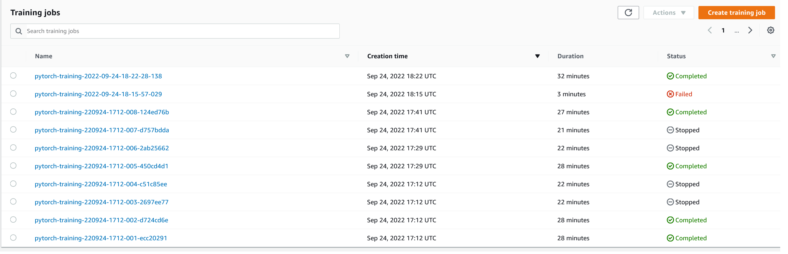
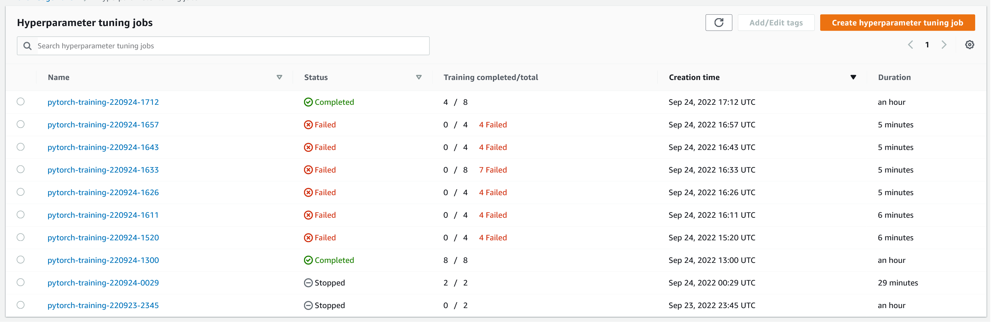
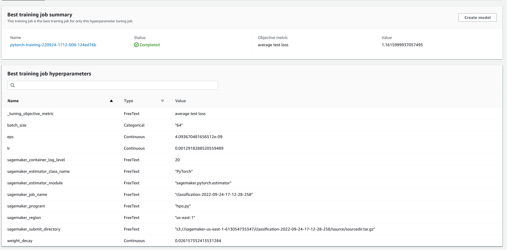
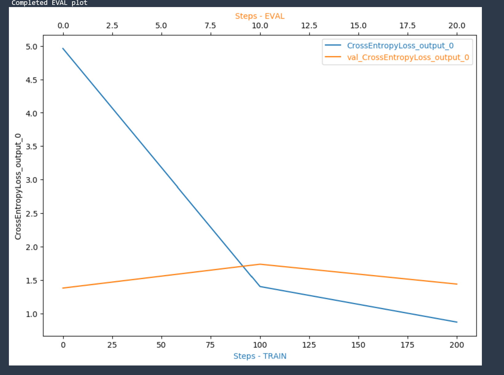
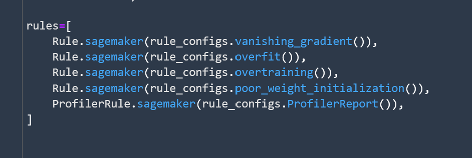
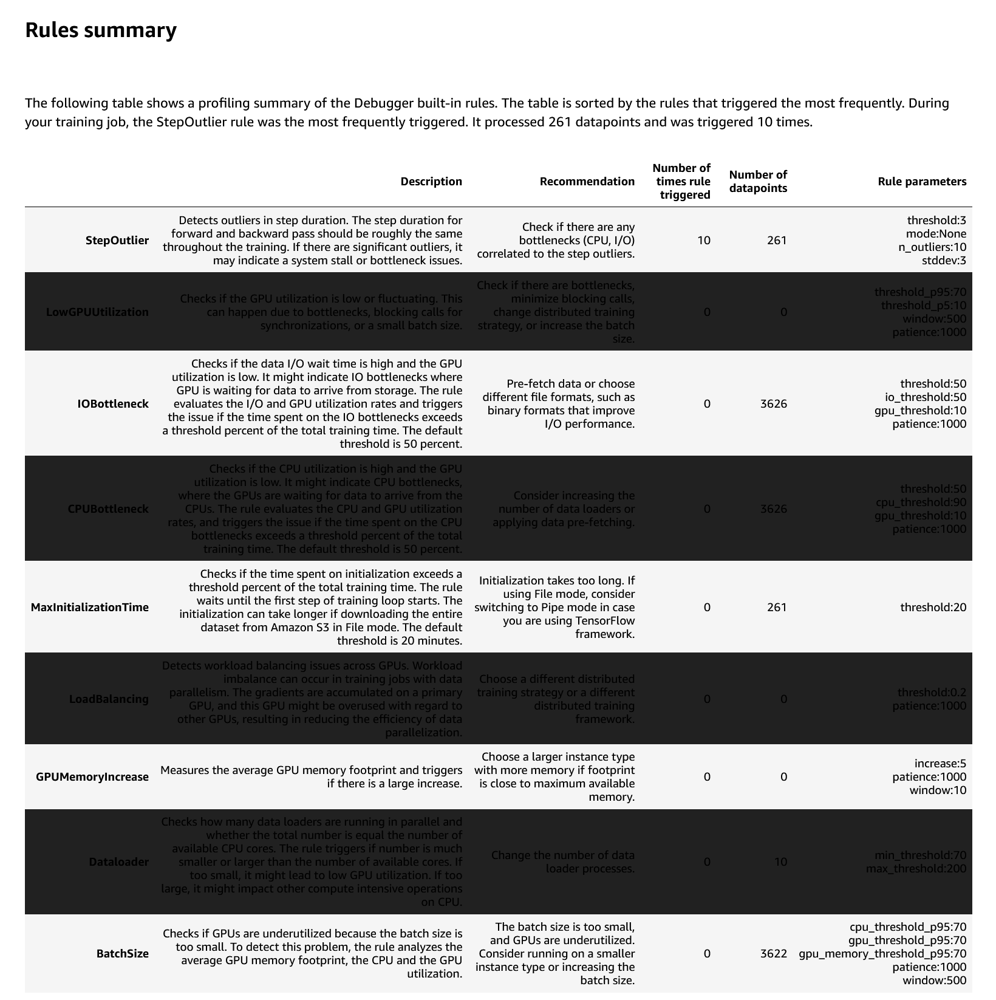

# Image Classification using AWS SageMaker

In this project, I use AWS Sagemaker to train a pretrained model that can perform image classification by using the Sagemaker profiling, debugger, hyperparameter tuning and other good ML engineering practices. This was done on a dog breed dataset.

## Dataset
The provided dataset is the dogbreed classification dataset which can be found in the classroom.
The project is designed to be dataset independent so if there is a dataset that is more interesting or relevant to your work, you are welcome to use it to complete the project.

## Hyperparameter Tuning

- The pre-trained model that I chose for this project was Inception v3. This is an image recognition model that has been shown to attain greater than 68% accuracy on the ImageNet dataset. The model is the culmination of many ideas developed by multiple researchers over the years. It is based on the original paper: ["Rethinking the Inception Architecture for Computer Vision"](https://arxiv.org/abs/1512.00567) by Szegedy, et. al.
- The model itself is made up of symmetric and asymmetric building blocks, including convolutions, average pooling, max pooling, concatenations, dropouts, and fully connected layers. Batch normalization is used extensively throughout the model and applied to activation inputs. Loss is computed using Softmax.

- The following hyperparameters were selected for tuning: 
    - **Learning rate** - learning rate defines how fast the model trains. A large learning rate allows the model to learn faster, with a small learning rate it takes a longer time for the model to learn but with more accuracy. The range is from 0.001 to 0.1.

    - **Batch size** - batch size is the number of examples from the training dataset used in the estimate of the error gradient. Batch size controls the accuracy of the estimate of the error gradient when training neural networks. The batch-size we choose between two numbers 64 and 128.

- The best hyperparameters selected were: {'batch_size': "64", 'eps': '4.093670481656512e-09', 'lr': '0.0012918288520559489', 'weight_decay': '0.026157352413531284'}

### All Training Jobs

### Hyperparameters Tuning Jobs

### Best Hyperparameters Tuning Job

## Debugging and Profiling
### Debugging Report
Plots show dependence between loss and step: Blue one shows the `train_loss/steps`, the Orange one shows the `test_loss/steps`.
### Train/Test loss plot:

### Debugging and Profile Rules:

### Profiling Results:

## Model Deployment
The model is deployed using `inference.py` script.

## Debugging and Profiling

    Debugging and Profiling was done with the help of the sagemaker.debugger module.
    Amazon SageMaker Debugger provides full visibility into training jobs of state-of-the-art machine learning models.
    This SageMaker Debugger module provides high-level methods to set up Debugger configurations to monitor, profile, and debug your training job.
    Configure the Debugger-specific parameters when constructing a SageMaker estimator to gain visibility and insights into your training job.

### Test prediction
In `train_and_deploy.ipynb` I run 4 test predictions, and the predictions are pretty accurate.
